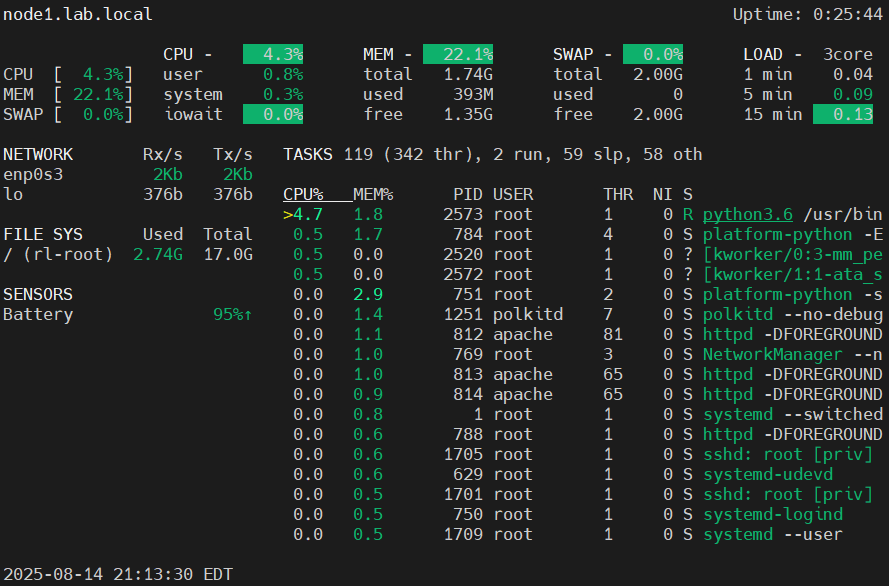

# Performance-Monitoring-
Performance monitoring involves tracking key system metrics to understand resource utilization, identify bottlenecks, and ensure stable and efficient operation. Various command-line tools and utilities are available for this purpose.

