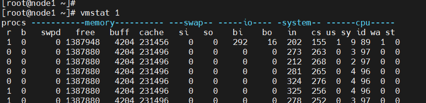
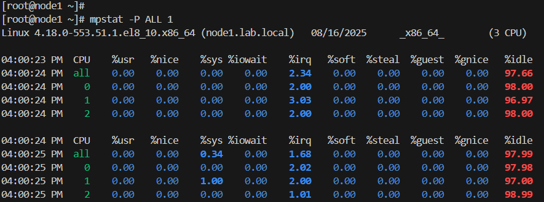
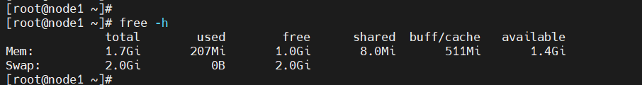
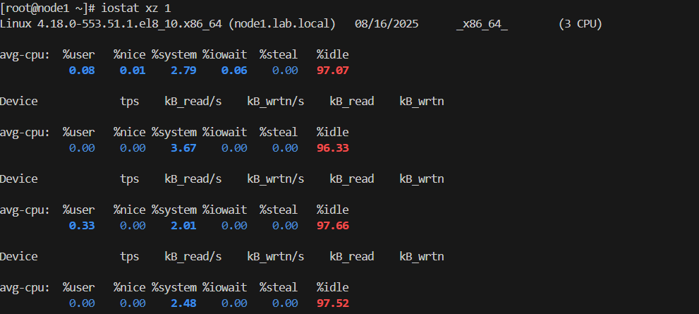

# Performance-Monitoring-
Performance monitoring involves tracking key system metrics to understand resource utilization, identify bottlenecks, and ensure stable and efficient operation. Various command-line tools and utilities are available for this purpose.

 📑 **Table of Contents**
 
- [CPU Usage](#cpu-usage)
- [Memory Usage](#memory-usage)
- [Disk I/O](#disk-i/o)
- [Storage Usage](#storage-usage)
- [Network Activity](#network-activity)
- [Processes](#processes)
- [Observation Tools Readings](#observation-tools-readings)

## CPU Usage

Monitor CPU load to identify system stress or misbehaving processes.

Commands: `top`, `htop`, `mpstat`, `vmstat` `sar`, `vmstat`,   `mstat`

What to Watch: High user/system % usage, load average, and CPU steal time (in virtualized environments)

## Memory Usage

Keep an eye on RAM and swap usage to prevent performance degradation.

Commands: `free -h`, `top`, `vmstat`

Key Metrics: Used/free memory, swap usage, cached memory

## Disk I/O

Disk I/O bottlenecks can slow down your applications significantly.

Commands: `iostat`, `iotop`, `dstat`

Metrics: Read/write speed, IOPS, wait time, and utilization

## Storage Usage

Avoid crashes and data loss by ensuring sufficient disk space.

Commands: `df -h`, `du -sh`, `lsblk`

Metrics: Disk usage per partition, inode usage

## Network Activity

Monitor bandwidth and network errors to diagnose connectivity issues.

Commands: `ip -s link`, `ss`, `netstat`, `iftop`, `nload`, `sar`

Metrics: Packets sent/received, errors, dropped packets, bandwidth

## Processes

dentify resource-hungry or zombie processes affecting system performance.

Commands: `top`, `ps aux`, `htop` `pidstat`

Focus Areas: CPU/memory usage by process, process state, run-time

## Observation Tools Readings

- r: Number of processes running on CPU, value greater than the CPU count is “saturation”.
- free: Free memory in kilobytes.
- si, so: Swap-in and swap-out. If these are non-zero, you’re probably out of memory “saturation” .
- us, sy, id, wa, st: the breakdown of CPU time, on average across all CPUs. They are user time, system time (kernel), idle, wait I/O, and stolen time (by other guests).
- In above example, CPU time is almost entirely in user-level, pointing to application level usage .

- Shows CPU time breakdown per CPU, can be used to check for an imbalance.
A single hot CPU could mean a single-threaded application for example.

- total: 1.7Gi: Total physical RAM available.

- used: 207Mi: Memory actively in use (excluding cache and buffers).

- free: 1.0Gi: Completely unused memory.

- shared: 8.0Mi: Memory used by tmpfs and shared between processes.

- buff/cache: 511Mi: Memory used by the kernel for buffers and cache (reclaimable).

- available: 1.4Gi: Estimation of memory available for new applications, accounting for reclaimable cache.

  

- r/s, w/s, rkB/s, wkB/s: These are the delivered reads, writes, read Kbytes, and write Kbytes per second to the device. A performance problem may simply be due to an excessive IO load.
  
- await: The average time for the I/O in milliseconds. This is the time that the application suffers, as it includes both time queued and time being serviced.
  
- High values can be an indicator of device “saturation” or device problems.
  
- avgqu-sz: The average number of requests issued to the device. Values greater than 1 can be evidence of “saturation” (although devices can process in parallel
